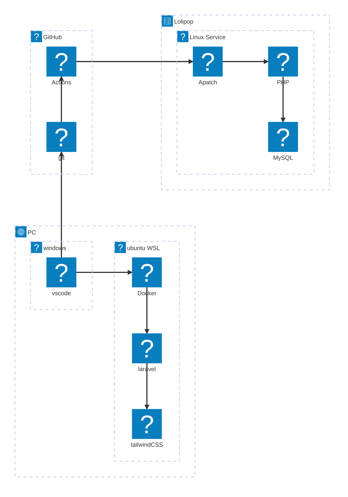
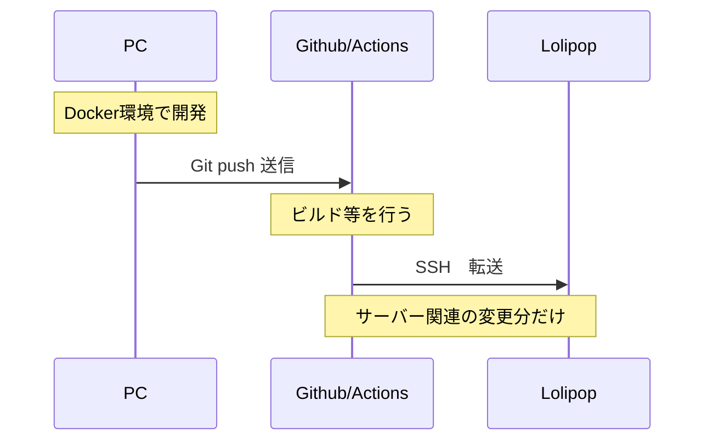
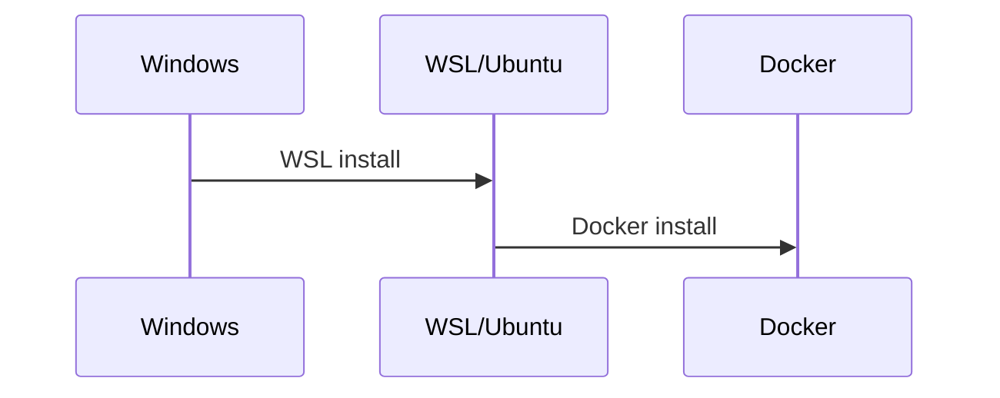

## システム構成図

```mermaid
architecture-beta
    group github(logos:git)[GitHub]
    group lolipop(server)[Lolipop]
    group PC(internet)[PC]
    group windows(mdi:windows)[windows] in PC
    group ubuntu(mdi:ubuntu)[ubuntu WSL] in PC
    group linux(logos:linux-tux)[Linux Service] in lolipop
    service git(logos:git-icon)[git] in github
	service actions(logos:github-actions)[Actions] in github
    service apache(logos:apache)[Apatch] in linux
    service php(logos:php)[PHP] in linux
    service MySQL(logos:mysql)[MySQL] in linux
    service docker(logos:docker-icon)[Docker] in ubuntu
	service laravel(logos:laravel)[laravel] in ubuntu
	service tailwindcss(logos:tailwindcss-icon)[tailwindCSS] in ubuntu
   	service vscode(logos:visual-studio)[vscode] in windows

    actions:B <-- T:git
	actions:R --> L:apache
	apache:R --> L:php
	php:B --> T:MySQL
	git:B <-- T:vscode
	vscode:R --> L:docker
	docker:B --> T:laravel
	laravel:B --> T:tailwindcss
```
## 開発環境の展開の流れ

```mermaid
sequenceDiagram
    participant PC
    participant Github/Actions
    participant Lolipop

	Note over PC: Docker環境で開発
    PC->>Github/Actions: Git push 送信
	Note over Github/Actions: ビルド等を行う
    Github/Actions->>Lolipop: SSH　転送
    Note over Github/Actions,Lolipop: サーバー関連の変更分だけ
```
## PCの開発環境構築の流れ

```mermaid
sequenceDiagram
    participant Windows
    participant WSL/Ubuntu
    participant Docker

    Windows->>WSL/Ubuntu: WSL install
    WSL/Ubuntu->>Docker: Docker install
```
## PCの開発環境構築の流れ

```mermaid
sequenceDiagram
    participant Windows
    participant WSL/Ubuntu
    participant Docker

    Windows->>WSL/Ubuntu: WSL install
    WSL/Ubuntu->>Docker: Docker install
```